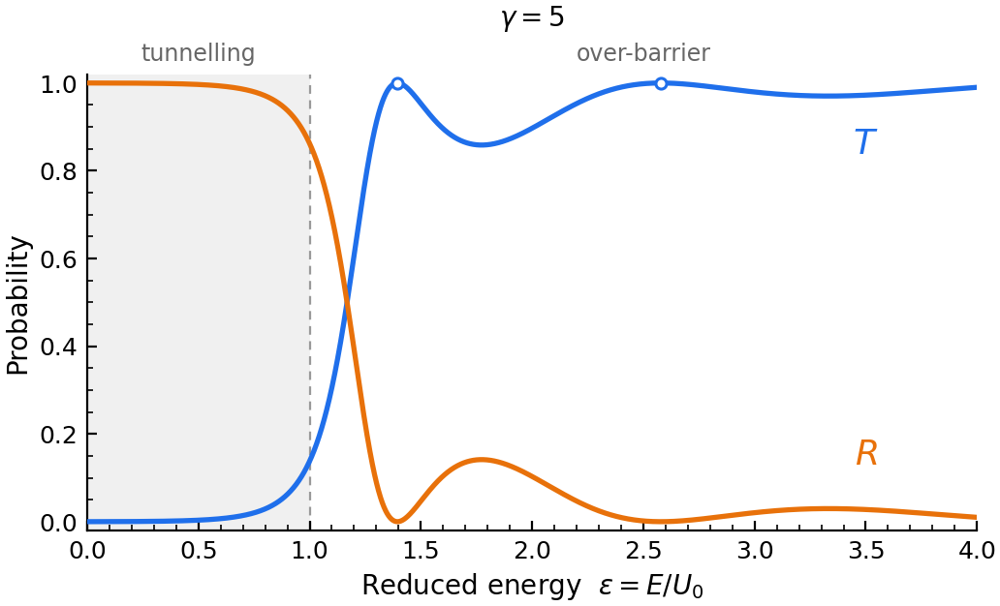
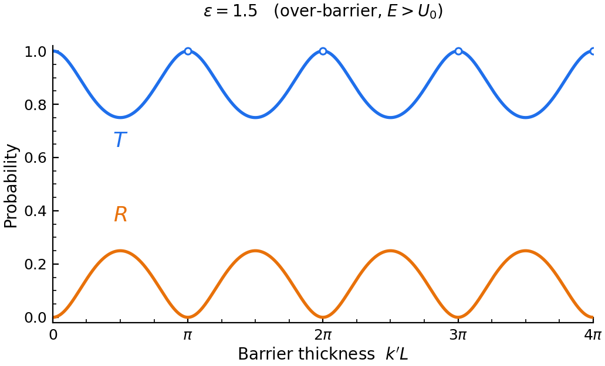

# Rectangular Barrier: Transmission and Reflection vs Barrier Strength

Exact stationary-state transmission $T$ and reflection $R$ probabilities for a
one-dimensional rectangular potential barrier, plotted against energy for a
family of dimensionless **barrier strength** parameters.

A single self-contained Python script. No configuration files, no data files,
no build step.



---

## The problem

A particle of mass $m$ and energy $E > 0$ is incident from the left on a
barrier of height $U_0$ and width $L$:

```
                     U(x)
                      ^
                      |        +-----------+
                 U0 --|        |           |
                      |        |           |
    --> incident      |        |  barrier  |
    <-- reflected     |        |           |     --> transmitted
                    0 +--------+-----------+-------------> x
                               0           L
```

Solving the time-independent Schrödinger equation in each region and matching
$\psi$ and $\psi'$ at $x = 0$ and $x = L$ gives $T$ and $R$ in closed form.

---

## Reduced variables

Everything collapses onto two dimensionless numbers.

**Reduced energy**

$$\varepsilon = \frac{E}{U_0}$$

**Barrier strength parameter**

$$\gamma = \frac{L}{\hbar}\sqrt{2mU_0}, \qquad \gamma^2 = \frac{2mU_0L^2}{\hbar^2}$$

The strength parameter has a direct physical reading. Define the zero-energy
penetration depth $\delta = \hbar/\sqrt{2mU_0}$, the distance over which the
wavefunction decays inside the barrier. Then

$$\gamma = \frac{L}{\delta}$$

so $\gamma$ is the barrier width measured in decay lengths: a pure measure of
opacity. Two barriers with different $U_0$ and $L$ but the same $\gamma$ give
identical $T(\varepsilon)$ curves. That is why the sweep is over $\gamma$
rather than over $U_0$ and $L$ separately.

---

## Closed-form results

**Tunnelling, $\varepsilon < 1$** — the wave is evanescent inside the barrier,
$\kappa L = \gamma\sqrt{1-\varepsilon}$:

$$T(\varepsilon) = \left[1 + \frac{\sinh^2\left(\gamma\sqrt{1-\varepsilon}\right)}{4\varepsilon(1-\varepsilon)}\right]^{-1}$$

Classically $T$ would be zero here. For a thick barrier this reduces to the
familiar exponential law

$$T \simeq 16\varepsilon(1-\varepsilon)e^{-2\gamma\sqrt{1-\varepsilon}}$$

**Over-barrier, $\varepsilon > 1$** — the wave propagates inside,
$k'L = \gamma\sqrt{\varepsilon-1}$:

$$T(\varepsilon) = \left[1 + \frac{\sin^2\left(\gamma\sqrt{\varepsilon-1}\right)}{4\varepsilon(\varepsilon-1)}\right]^{-1}$$

Classically $T$ would be one here. It is not: the particle can be reflected by
a downward step.

**At $\varepsilon = 1$** the two branches meet and the apparent $0/0$ is
removable:

$$T(1) = \frac{1}{1 + \gamma^2/4}$$

**In all cases** $R = 1 - T$, which is conservation of probability current.

---

## Transmission resonances

Above the barrier, $T$ returns to exactly 1 whenever $\sin(k'L) = 0$:

$$\varepsilon_n = 1 + \left(\frac{n\pi}{\gamma}\right)^2, \qquad n = 1, 2, 3, \dots$$

Equivalently $L = n\lambda_{\text{in}}/2$. An integer number of half wavelengths
fits inside the barrier, the waves reflected from the two edges interfere
destructively, and the barrier becomes perfectly transparent. This is the
quantum analogue of an anti-reflection coating or a Fabry–Pérot cavity on
resonance. Larger $\gamma$ packs more resonances into a given energy window.

---

## Results

Both figures are produced by `barrier_TR.py` and committed under `figures/`.

### Transmission and reflection versus energy

The figure at the top of this README fixes the barrier ($\gamma = 5$) and sweeps the
energy. $T$ and $R$ share one axes, so three things are visible at once:

- They cross at $T = R = \tfrac{1}{2}$, and sum to 1 at every energy.
- In the shaded strip $\varepsilon < 1$, $T$ is small but **not zero** — the tunnelling
  that classical mechanics forbids outright.
- Above the barrier top $T$ does not saturate at 1; it oscillates, and $R$ stays
  visibly nonzero. Open circles mark the resonances
  $\varepsilon_n = 1 + (n\pi/\gamma)^2$ where $T$ returns to exactly 1.

At the barrier top the closed form collapses to $T(1) = (1 + \gamma^2/4)^{-1}$:

| $\gamma$ | 1 | 2 | 5 | 10 | 20 |
|---|---|---|---|---|---|
| $T(\varepsilon = 1)$ | 0.800 | 0.500 | 0.1379 | 0.03846 | 0.00990 |

### Transmission and reflection versus barrier thickness



The perpendicular cut: energy fixed at $\varepsilon = 1.5$, barrier thickness sweeping.
Now $T$ starts at **1** and dips, returning to 1 at every $k'L = n\pi$ — an integer
number of half wavelengths fits inside, the reflections off the two edges cancel,
and the barrier goes transparent. This is the anti-reflection coating condition,
and it is far easier to read here than on the energy axis.

### Why the two figures run opposite ways

They look inverted, and that is expected — the abscissas point in opposite physical
directions:

| | swept quantity | $T$ at the left edge | reason |
|---|---|---|---|
| versus energy | $\varepsilon = E/U_0$ | $T \to 0$ | a particle with no energy gets through nothing |
| versus thickness | $k'L$ | $T \to 1$ | a barrier with no width blocks nothing |

Both come from the same closed form. `transmission_vs_thickness(u, eps)` and
`transmission(eps, gamma)` agree to 12 decimal places wherever
$u = \gamma\sqrt{|1-\varepsilon|}$ makes them describe the same barrier — they are two cuts
through one surface $T(\varepsilon, \gamma)$, not two different results.

### Numerical check

The script reports the unitarity residual on every run. Across all five $\gamma$
values on a 6001-point grid:

```
unitarity check:  max |T + R - 1|  =  2.220e-16
```

That is one unit in the last place of a float64. $T$ and $R$ are each evaluated from
their own closed form, never as $1 -$ the other, so the agreement is a real check
rather than an identity by construction.

---

## Symbols

| Symbol | Meaning | Units |
|---|---|---|
| $E$ | incident particle energy | J (or eV) |
| $U_0$ | barrier height | J (or eV) |
| $L$ | barrier width | m (or nm) |
| $m$ | particle or effective mass | kg |
| $\hbar$ | reduced Planck constant | J·s |
| $\varepsilon = E/U_0$ | reduced energy | — |
| $\gamma = (L/\hbar)\sqrt{2mU_0}$ | barrier strength parameter | — |
| $\delta = \hbar/\sqrt{2mU_0}$ | zero-energy penetration depth | m |
| $\kappa = \sqrt{2m(U_0-E)}/\hbar$ | decay constant inside, $\varepsilon<1$ | 1/m |
| $k' = \sqrt{2m(E-U_0)}/\hbar$ | wavenumber inside, $\varepsilon>1$ | 1/m |
| $T$ | transmission probability | — |
| $R$ | reflection probability | — |
| $\varepsilon_n$ | over-barrier resonance energies | — |

---

## Usage

```bash
git clone https://github.com/HaraprasadMoharana/rectangular-barrier-TR.git
cd rectangular-barrier-TR
pip install -r requirements.txt
python barrier_TR.py
```

Running the script prints the symbol table, reports the unitarity residual
$\max|T + R - 1|$, and writes the figures.

### Outputs

| File | Contents |
|---|---|
| `barrier_TR_overlaid.png` / `.pdf` | $T$ and $R$ overlaid against energy for one $\gamma$ — the first figure above |
| `barrier_TR_thickness.png` / `.pdf` | $T$ and $R$ against barrier thickness at fixed energy — the second figure above |
| `barrier_TR_vs_eps.png` / `.pdf` | two-panel $T(\varepsilon)$ and $R(\varepsilon)$ across the full $\gamma$ family |
| `barrier_TR_log.png` / `.pdf` | $T$ on a log axis over the tunnelling region, exposing the $e^{-2\gamma\sqrt{1-\varepsilon}}$ law |

Running the script writes these four files next to it. They are build output, not
source — the committed copies under `figures/` are what this README displays.

### Configuration

Edit the `CONFIG` block at the top of `barrier_TR.py`:

| Variable | Role |
|---|---|
| `GAMMA_LIST` | barrier strength values to overlay |
| `EPS_MIN`, `EPS_MAX`, `N_EPS` | energy grid |
| `LOG_PANEL` | produce the log-scale tunnelling figure |
| `OVERLAY`, `GAMMA_SHOW` | produce the overlaid $T$/$R$ figure, and at which $\gamma$ |
| `THICKNESS`, `EPS_FIXED` | produce the thickness figure, and at which $\varepsilon > 1$ |
| `MARK_RES` | mark over-barrier resonances |
| `SHOW_DEFS` | print the symbol table on run |
| `SAVE`, `OUTSTEM`, `DPI` | figure output |
| `X_ASYMP` | $\kappa L$ above which the asymptotic form is used |

### Working in physical units

```python
from barrier_TR import gamma_from_physical, penetration_depth_nm, transmission

g = gamma_from_physical(U0_eV=..., L_nm=..., m_rel=...)   # m_rel = 1.0 for a free electron
T = transmission(eps=..., gamma=g)
```

---

## Numerical notes

- `sinh(x)` overflows 64-bit floats past $x \approx 710$, which is reached at
  low $\varepsilon$ once $\gamma$ is large. Above `X_ASYMP` the exact formula is
  replaced by $T \to 4\left[4\varepsilon(1-\varepsilon)\right]e^{-2x}$, whose
  relative error is itself $O(e^{-2x})$ and therefore negligible there.
- $R$ is computed from its own closed form, not as $1 - T$. Near a resonance
  $R$ collapses toward zero, and forming $1-T$ there would lose all significant
  digits to cancellation.
- $\varepsilon = 1$ is handled as an explicit special case within a narrow
  window, since both numerator and denominator vanish there.
- The unitarity residual printed at runtime sits at the machine-epsilon level.

---

## Requirements

Python 3.8 or newer, NumPy, Matplotlib. See `requirements.txt`.

---

## License

MIT. See [LICENSE](LICENSE).
